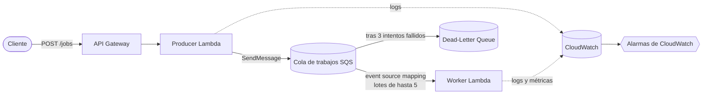

# AWS CDK Asynchronous Job Queue

🌐 Idioma: [English](README.md) | **Español**

### API Gateway → Lambda → SQS → Lambda

Un ejemplo completo pero intencionalmente simple y educativo de AWS CDK que
demuestra el **procesamiento asíncrono de trabajos en segundo plano** usando
API Gateway, Lambda, SQS (con una cola de mensajes fallidos o
*dead-letter queue*) y CloudWatch — construido en TypeScript.

El escenario: un cliente le pide a la API que genere un reporte. La API
acepta la solicitud y responde de inmediato; un worker separado realiza el
trabajo (simulado) más adelante, completamente desacoplado de la solicitud
HTTP. Ese desacoplamiento — y todo lo que conlleva (reintentos, procesamiento
por lotes, fallos parciales, límites de concurrencia, entrega al menos una
vez) — es justamente lo que este repositorio está construido para enseñar.

> Este proyecto está optimizado para la **claridad por encima de la
> abstracción**. Está pensado para ser leído, desplegado, explorado y roto
> a propósito.

---

## Tabla de contenidos

- [Problema que resuelve esta arquitectura](#problema-que-resuelve-esta-arquitectura)
- [Diagrama de arquitectura](#diagrama-de-arquitectura)
- [Recursos creados](#recursos-creados)
- [Ciclo de vida de la solicitud](#ciclo-de-vida-de-la-solicitud)
- [Entendiendo el tiempo de visibilidad de SQS](#entendiendo-el-tiempo-de-visibilidad-de-sqs)
- [Procesamiento por lotes](#procesamiento-por-lotes)
- [Fallos parciales en un lote](#fallos-parciales-en-un-lote)
- [Reintentos y la cola de mensajes fallidos](#reintentos-y-la-cola-de-mensajes-fallidos)
- [Concurrencia y contrapresión](#concurrencia-y-contrapresión)
- [Por qué importa la idempotencia](#por-qué-importa-la-idempotencia)
- [Escenarios de fallo](#escenarios-de-fallo)
- [Cómo probar el sistema](#cómo-probar-el-sistema)
- [Despliegue](#despliegue)
- [Eliminación de recursos](#eliminación-de-recursos)
- [Seguridad](#seguridad)
- [Costo](#costo)
- [¿Qué cambiaría para producción?](#qué-cambiaría-para-producción)
- [Alternativas arquitectónicas consideradas](#alternativas-arquitectónicas-consideradas)
- [Estructura del repositorio](#estructura-del-repositorio)

---

## Problema que resuelve esta arquitectura

Imagina un endpoint de API que genera un reporte. Generar el reporte puede
tardar varios segundos, o minutos.

**Enfoque síncrono:**

```text
Cliente → API → Generar reporte → Esperar → Respuesta
```

La conexión HTTP permanece abierta durante toda la duración del trabajo. La
API queda fuertemente acoplada a la generación del reporte: si la generación
es lenta, la solicitud es lenta; si la generación falla, toda la solicitud
falla; si llegan 1,000 solicitudes al mismo tiempo, 1,000 procesos de
generación de reportes intentan ejecutarse a la vez.

**Enfoque asíncrono (este repositorio):**

```text
Cliente
   ↓
API Gateway
   ↓
Producer Lambda  →  202 Accepted (de vuelta al cliente, de inmediato)
   ↓
Cola de trabajos SQS
   ↓
Worker Lambda  (se ejecuta después, de forma independiente)
```

La API acepta el trabajo, lo entrega a una cola y responde de inmediato. El
worker procesa el trabajo según su propio ritmo, con su propia concurrencia
controlada. Esto mejora:

- **Resiliencia** — un fallo del worker no hace fallar la solicitud del
  cliente; el mensaje simplemente espera y se reintenta.
- **Escalabilidad** — el tiempo de respuesta de la API ya no depende de
  cuánto tarde la generación del reporte.
- **Manejo de ráfagas (burst handling)** — SQS absorbe los picos de demanda;
  el worker drena la cola a un ritmo estable y controlado.
- **Aislamiento de fallos** — un trabajo defectuoso no derriba todo el lote,
  y los trabajos que fallan repetidamente quedan aislados en la DLQ en lugar
  de bloquear todo lo que viene detrás.

## Diagrama de arquitectura



Consulta [`docs/es/architecture.md`](docs/es/architecture.md) para un
desglose más profundo, incluyendo un diagrama de secuencia y las rutas de
reintento/DLQ.

## Recursos creados

| Recurso | Propósito |
|---|---|
| **API Gateway REST API** | Expone `POST /jobs` sobre HTTPS e invoca de forma síncrona al producer Lambda. |
| **Producer Lambda** | Valida la solicitud, genera un `jobId`, envía el trabajo a SQS y devuelve `202 Accepted`. |
| **Cola principal de SQS** (`job-queue`) | Almacena de forma durable los trabajos pendientes; aplica el tiempo de visibilidad; rastrea el número de recepciones. |
| **Cola de mensajes fallidos de SQS** (`job-queue-dlq`) | Recibe los mensajes que fallaron al procesarse 3 veces; los aísla para su investigación. |
| **Worker Lambda** | Consume lotes de la cola principal; procesa cada trabajo de forma independiente; reporta fallos parciales del lote. |
| **Event source mapping de SQS** | El componente administrado por AWS que sondea la cola e invoca al worker con lotes — no requiere código de sondeo personalizado. |
| **Grupos de logs de CloudWatch** | Uno por cada función Lambda, capturando logs JSON estructurados (`jobId`, `reportType`, número de recepciones, etc.). |
| **Alarmas de CloudWatch** | DLQ con mensajes, edad del mensaje más antiguo y errores del worker (ver [Escenarios de fallo](#escenarios-de-fallo)). |

## Ciclo de vida de la solicitud

```text
 1. El cliente envía POST /jobs.
 2. API Gateway invoca al Producer Lambda.
 3. El producer valida el cuerpo y genera un jobId.
 4. El producer envía el trabajo a SQS (SendMessage).
 5. El producer retorna, y API Gateway responde con HTTP 202.
 6. De forma independiente, el event source mapping de AWS Lambda sondea SQS.
 7. El worker recibe un lote de hasta 5 trabajos.
 8. El worker procesa cada trabajo de forma independiente.
 9. Los mensajes exitosos se eliminan automáticamente.
10. Los mensajes fallidos permanecen en la cola y vuelven a hacerse
    visibles cuando expira el tiempo de visibilidad.
11. Los mensajes que fallan 3 veces se enrutan a la cola de mensajes
    fallidos.
```

Los pasos 1–5 ocurren dentro de un único ciclo de solicitud/respuesta HTTP.
Los pasos 6–11 ocurren de forma completamente independiente, según su
propio ritmo — **el cliente nunca está esperando por ellos.**

Importante: **AWS administra el sondeo de SQS.** El código del worker nunca
abre un bucle que pregunte "¿hay mensajes nuevos?" — ese mecanismo (el
event source mapping) está integrado en Lambda.

## Entendiendo el tiempo de visibilidad de SQS

Cuando el event source mapping de Lambda recibe un mensaje de SQS, SQS
**no** lo elimina de inmediato. En su lugar, se vuelve temporalmente
**invisible** para otros consumidores durante el tiempo de visibilidad
(*visibility timeout*) configurado en la cola.

```text
Mensaje disponible en la cola
        ↓
El worker lo recibe (vía el event source mapping)
        ↓
El mensaje se vuelve invisible para otros receptores
        ↓
El worker procesa el trabajo
        ↓
   ┌─────────────┴─────────────┐
   ▼                           ▼
Éxito:                     Fallo:
el mensaje se elimina     el mensaje NO se elimina
                                ↓
                     expira el tiempo de visibilidad
                                ↓
                     el mensaje vuelve a ser visible
                                ↓
                            se reintenta
```

Este mecanismo es lo que hace posibles los reintentos — un mensaje fallido
no se pierde, simplemente vuelve a aparecer después del tiempo de
visibilidad.

**El timeout de Lambda no es lo mismo que el tiempo de visibilidad de
SQS.** Son dos configuraciones independientes que deben razonarse en
conjunto:

| Configuración | Valor en este ejemplo | Qué controla |
|---|---|---|
| Timeout del Worker Lambda | 15 segundos | Cuánto tiempo AWS permite que se ejecute una sola invocación antes de detenerla. |
| Tiempo de visibilidad de SQS | 90 segundos | Cuánto tiempo un mensaje recibido permanece oculto para otros consumidores. |

El tiempo de visibilidad se configura deliberadamente **por encima** del
timeout de Lambda. Si fuera más corto que (o demasiado cercano a) el tiempo
que el worker realmente necesita, SQS podría hacer visible el mensaje de
nuevo — y entregarlo a una *segunda* invocación — **mientras la primera
invocación todavía se está ejecutando**. Ahora dos workers estarían
procesando el mismo trabajo de forma concurrente, lo cual es trabajo
desperdiciado en el mejor de los casos, y un error de correctitud en el
peor, si el trabajo tiene efectos secundarios.

Esto también se conecta directamente con la semántica de entrega: SQS
provee **entrega al menos una vez** (*at-least-once delivery*). Incluso con
un tiempo de visibilidad bien ajustado, un worker puede ocasionalmente
recibir el mismo mensaje lógico más de una vez (por ejemplo, si terminó el
trabajo pero el acuse de eliminación no llegó a SQS a tiempo). Ver
[Por qué importa la idempotencia](#por-qué-importa-la-idempotencia).

## Procesamiento por lotes

```text
Cola SQS:  [A] [B] [C] [D] [E]

                  ↓  el event source mapping entrega hasta batchSize (5)

Invocación del Worker Lambda:
  event.Records = [A, B, C, D, E]
```

El procesamiento por lotes significa que se necesitan menos invocaciones de
Lambda para drenar una cantidad determinada de trabajos — más eficiente, y
más económico a escala (ver
[`docs/es/cost-considerations.md`](docs/es/cost-considerations.md)). La
contrapartida: un lote más grande implica que una sola invocación toca más
mensajes a la vez, por lo que un error que colapsa *toda* la función (en
lugar de fallar un solo trabajo) tiene un radio de impacto mayor.
`batchSize: 5` aquí es lo suficientemente pequeño como para observar
trabajos individuales moviéndose a través de un lote durante una
demostración en vivo.

## Fallos parciales en un lote

Este es uno de los comportamientos más importantes que enseña este
repositorio.

```text
Lote recibido:
  A → éxito
  B → éxito
  C → fallo
  D → éxito
  E → éxito
```

**Sin una respuesta de fallo parcial del lote**, lanzar una excepción hace
fallar *toda* la invocación, y SQS haría visibles de nuevo los **cinco**
mensajes (A–E) para reintento — incluyendo cuatro que ya habían tenido
éxito.

**Con una respuesta de fallo parcial del lote**
(`reportBatchItemFailures: true` en el event source mapping), el worker
devuelve exactamente qué mensajes fallaron:

```json
{
  "batchItemFailures": [
    { "itemIdentifier": "message-id-for-C" }
  ]
}
```

Solo `C` se reintenta. `A`, `B`, `D` y `E` se eliminan como exitosos y nunca
se vuelven a procesar. El handler del worker (`src/worker/handler.ts`)
implementa esto directamente:

```typescript
export const handler = async (event: SQSEvent): Promise<SQSBatchResponse> => {
  const batchItemFailures: SQSBatchItemFailure[] = [];

  for (const record of event.Records) {
    try {
      await processRecord(record);
    } catch (error) {
      batchItemFailures.push({ itemIdentifier: record.messageId });
    }
  }

  return { batchItemFailures };
};
```

Nota el `try`/`catch` por cada registro — el bucle nunca lanza una excepción
para todo el lote solo porque un trabajo haya fallado.

## Reintentos y la cola de mensajes fallidos

```text
Trabajo
 │
 ▼
Intento 1 ──✕ falla──▶ espera (tiempo de visibilidad)
 │
 ▼
Intento 2 ──✕ falla──▶ espera (tiempo de visibilidad)
 │
 ▼
Intento 3 ──✕ falla──▶ se mueve a la Dead-Letter Queue
```

El número exacto de intentos está regido por la **política de redrive**
(*redrive policy*) de la cola, configurada aquí como `maxReceiveCount: 3` en
la cola principal, apuntando a la cola de mensajes fallidos `job-queue-dlq`.

**Qué es una DLQ:** un lugar donde aislar de forma durable los mensajes que
no pudieron procesarse tras repetidos intentos, para que puedan ser
inspeccionados y, si corresponde, reenviados manualmente (*redrive*).

**Qué no es una DLQ:** una solución automática. Nada en este stack reintenta,
repara o descarta automáticamente los mensajes de la DLQ — una persona (o un
proceso de remediación independiente) tiene que decidir qué hacer con ellos.
Ver [`docs/es/troubleshooting.md`](docs/es/troubleshooting.md) para el flujo
de investigación.

Puedes activar toda esta ruta a demanda — ver
[Cómo probar el sistema](#cómo-probar-el-sistema) a continuación.

## Concurrencia y contrapresión

```text
Trabajos entrantes
   ↓ ↓ ↓ ↓ ↓ ↓ ↓ ↓
       Cola SQS                  (absorbe la ráfaga)
     ↓         ↓
  Worker #1  Worker #2           (reservedConcurrentExecutions: 2)
```

`reservedConcurrentExecutions` del worker Lambda está fijado en **2** —
deliberadamente pequeño para que sea fácil de observar en una demostración.
Esto *no* limita qué tan rápido se pueden *enviar* trabajos; limita cuántos
trabajos pueden *procesarse simultáneamente*. La cola absorbe todo lo que
exceda ese límite:

- SQS puede sostener un backlog grande sin ninguna configuración especial.
- Solo 2 ejecuciones del worker corren a la vez, sin importar cuántos
  mensajes estén esperando.
- Esto protege a cualquier sistema downstream que llame el worker de verse
  desbordado por un pico de tráfico.
- La profundidad de la cola (y `ApproximateAgeOfOldestMessage`) se convierte
  en una medida directa y observable de **contrapresión** (*backpressure*)
  — cuánto trabajo está esperando por capacidad.

Un modelo mental simplificado (no una fórmula precisa — los sistemas reales
tienen más variables):

```text
throughput aproximado ≈ workers concurrentes × (1 / tiempo de procesamiento por trabajo)
```

## Por qué importa la idempotencia

SQS provee **entrega al menos una vez** (*at-least-once delivery*) — no
exactamente una vez. Considera:

```text
El worker termina de procesar un trabajo
        ↓
Ocurre una interrupción de red antes de que se confirme la eliminación
        ↓
Expira el tiempo de visibilidad
        ↓
SQS entrega el mismo trabajo de nuevo
```

El worker debe estar preparado para ver el mismo `jobId` más de una vez y
comportarse de forma segura. Este ejemplo no implementa un almacén de
idempotencia persistente (agregar uno, p. ej. DynamoDB, únicamente para
demostrar esto le quitaría foco a la lección sobre colas) — pero muestra
exactamente dónde iría uno, en `src/worker/handler.ts`:

```typescript
// 1. Buscar job.jobId en un almacén de idempotencia (p. ej. DynamoDB).
// 2. Si ya está marcado como COMPLETED, retornar éxito sin repetir el trabajo.
// 3. En caso contrario, procesar el trabajo.
// 4. Registrar la finalización de forma atómica (p. ej. un PutItem condicional).
```

Para producción, opciones razonables incluyen:

- **Escrituras condicionales en DynamoDB** — un registro `jobId → COMPLETED`
  con una expresión de condición que evite condiciones de carrera de doble
  procesamiento.
- **Utilidad de idempotencia de
  [Powertools for AWS Lambda](https://docs.powertools.aws.dev/lambda/typescript/latest/utilities/idempotency/)**
  — una librería mantenida que implementa este patrón.
- **Deduplicación específica del dominio** — por ejemplo, si "generar el
  reporte de ventas mensual de agosto" es naturalmente idempotente
  (regenerarlo simplemente sobrescribe la misma salida), es posible que no
  necesites un almacén explícito en absoluto.

## Escenarios de fallo

| Fallo | Qué ocurre |
|---|---|
| El producer no puede alcanzar SQS | La solicitud a la API falla (5xx); no se encola ningún trabajo. |
| El worker falla (excepción no manejada fuera del manejo por trabajo) | Nada del lote se elimina; todo el lote vuelve a ser visible tras el tiempo de visibilidad. |
| Un mensaje del lote falla | Solo ese mensaje se reintenta, vía la respuesta de fallo parcial del lote. |
| Un trabajo falla repetidamente | Tras 3 recepciones, el mensaje se mueve a la DLQ. |
| Se agota la concurrencia del worker (2) | Los mensajes adicionales simplemente esperan en la cola — esto es contrapresión, no un error. |
| Se entrega un mensaje duplicado | Esperado bajo la entrega al menos una vez; un worker de producción debe ser idempotente (ver arriba). |

## Cómo probar el sistema

Después de desplegar (ver [Despliegue](#despliegue)), obtén la URL de la
API desde los outputs del stack:

```bash
export API_URL=$(aws cloudformation describe-stacks \
  --stack-name AwsCdkLambdaSqsWorkerStack \
  --query "Stacks[0].Outputs[?OutputKey=='ApiUrl'].OutputValue" \
  --output text)
```

**Enviar un trabajo normal:**

```bash
curl -X POST "${API_URL}jobs" \
  -H "Content-Type: application/json" \
  -d '{
    "reportType": "monthly-sales",
    "requestedBy": "demo@example.com"
  }'
```

Deberías recibir de inmediato un `202` con un `jobId` — antes de que
ocurra cualquier "generación" del reporte.

**Enviar un trabajo que falle deliberadamente** (para observar la ruta de
reintento → DLQ):

```bash
curl -X POST "${API_URL}jobs" \
  -H "Content-Type: application/json" \
  -d '{
    "reportType": "monthly-sales",
    "requestedBy": "demo@example.com",
    "simulateFailure": true
  }'
```

**Qué observar, en orden:**

1. **Respuesta de la API** — sigue siendo `202 Accepted` de inmediato; la
   API no tiene idea de que el trabajo fallará.
2. **Logs de CloudWatch del producer** (`/aws/lambda/job-queue-producer`) —
   "Job accepted" / "Job sent to queue" con el `jobId`.
3. **Métricas de la cola SQS** (consola o
   `aws cloudwatch get-metric-statistics` sobre
   `ApproximateNumberOfMessagesVisible` / `ApproximateAgeOfOldestMessage`
   para `job-queue`) — observa el conteo y la edad de los mensajes.
4. **Logs de CloudWatch del worker** (`/aws/lambda/job-queue-worker`) —
   "Processing job", luego "Simulated failure for job `<id>`", repitiéndose
   con una cadencia de ~90s a medida que expira el tiempo de visibilidad y
   el mensaje se vuelve a entregar.
5. **`ApproximateReceiveCount`** — registrado por el worker en cada
   intento; obsérvalo subir de 1 a 2 a 3.
6. **DLQ** — tras el 3er fallo, revisa la cola `job-queue-dlq` (consola o
   `aws sqs receive-message --queue-url <dlq-url>`) para ver el mensaje, y
   confirma que la alarma `job-queue-dlq-has-messages` haya pasado a
   `ALARM`.

## Despliegue

```bash
npm install
npm test
npm run build
npx cdk synth
npx cdk diff
npx cdk deploy
```

Si nunca has desplegado aplicaciones CDK en esta cuenta/región de AWS
antes, necesitas hacer el bootstrap **una sola vez** (no en cada
despliegue):

```bash
npx cdk bootstrap
```

## Eliminación de recursos

```bash
npx cdk destroy
```

Esto elimina todos los recursos creados por este stack (API Gateway, ambas
funciones Lambda, ambas colas SQS, alarmas, y sus grupos de logs). Ten en
cuenta que los grupos de logs de CloudWatch y otros recursos pueden
comportarse de forma distinta según la política de eliminación configurada
(*removal policy*) — revisa la salida de `cdk diff` antes de destruir si no
estás seguro de qué se eliminará.

## Seguridad

Resumen: el producer solo puede enviar mensajes a la cola de trabajos; el
worker solo puede recibir/eliminar de ella; ninguno tiene permisos amplios
sobre SQS; la API es solo TLS pero **no está autenticada** en este ejemplo
(un despliegue real necesita autenticación de la API). Los detalles
completos, incluyendo lo que está implementado aquí frente a lo recomendado
para producción, están en
[`docs/es/security.md`](docs/es/security.md).

## Costo

Resumen: el costo está determinado por las solicitudes de API Gateway, las
invocaciones y duración de Lambda (ambas funciones), las llamadas a la API
de SQS y el volumen de CloudWatch Logs. El procesamiento por lotes reduce
el número de invocaciones del worker; una cola suaviza la carga pero no
reduce el costo total de procesamiento. Los precios cambian con el tiempo —
ver [`docs/es/cost-considerations.md`](docs/es/cost-considerations.md)
para una discusión más completa, y siempre revisa las páginas de precios
actuales de AWS antes de estimar una carga de trabajo real.

## ¿Qué cambiaría para producción?

Este ejemplo se detiene deliberadamente antes de estar listo para
producción, para que los conceptos de colas permanezcan en primer plano.
En concreto:

**Implementado en este ejemplo:**
- Procesamiento asíncrono desacoplado vía SQS
- Manejo de fallos parciales del lote
- DLQ con política de redrive
- Concurrencia reservada
- Alarmas básicas de CloudWatch
- IAM de mínimo privilegio por función

**Recomendado para producción** (no implementado aquí):
- Autenticación/autorización de la API
- Estado persistente de los trabajos y un almacén real de idempotencia
  (p. ej. DynamoDB)
- Una API de estado `GET /jobs/{jobId}` respaldada por ese almacén (ver
  abajo)
- Validación de entrada más estricta
- IDs de correlación y trazabilidad distribuida (p. ej. AWS X-Ray)
- Dashboards operacionales estructurados
- Notificaciones de alarmas (p. ej. SNS + integración con guardia on-call)
- Clasificación de reintentos (errores reintentables vs. no reintentables
  manejados de forma distinta)
- Una estrategia definida de redrive para la DLQ
- Cifrado con llaves KMS administradas por el cliente
- Gestión de secretos (si el worker necesita credenciales)
- Entornos de despliegue separados y CI/CD
- Pruebas de integración y de carga
- Planificación de concurrencia basada en tráfico real y capacidad
  downstream
- Umbrales de alertas operacionales basados en líneas base reales de
  profundidad de cola

**Sin API de estado de trabajos, a propósito:** este ejemplo no implementa
`GET /jobs/{jobId}`, porque eso requeriría estado persistente de los
trabajos (p. ej. una tabla de DynamoDB que rastree el estado por `jobId`),
lo cual es una preocupación separada de la mecánica de colas en la que se
enfoca este repositorio. En un sistema de producción, típicamente
agregarías un endpoint de este tipo respaldado por el mismo almacén usado
para la idempotencia.

## Alternativas arquitectónicas consideradas

| Alternativa | Buena para | Por qué no se usa aquí |
|---|---|---|
| **Lambda síncrona** (`API Gateway → Lambda`, sin cola) | Trabajo rápido donde el llamador necesita un resultado inmediato. | No encaja con trabajo de fondo de larga duración; acopla la latencia de la API al tiempo de procesamiento. |
| **SNS** | Fan-out / pub-sub hacia múltiples suscriptores. | Problema distinto — SNS no provee una cola de trabajo durable con tiempos de visibilidad y semántica de reintento por mensaje como lo hace SQS. |
| **EventBridge** | Enrutamiento de eventos e integración orientada a eventos entre servicios. | Más adecuado para enrutar/filtrar eventos que para actuar como una cola de trabajo simple. |
| **Step Functions** | Flujos de trabajo multi-paso: ramificación, reintentos con lógica personalizada, pasos de aprobación humana, orquestación. | Sería excesivo para una operación tan simple como "procesar un trabajo". |
| **AWS Batch / ECS/Fargate** | Cargas de cómputo pesadas o de larga duración. | Excesivo para trabajos cortos, en ráfagas y orientados a eventos como la generación de reportes simulada de este ejemplo. |
| **Invocación asíncrona directa de Lambda** (`Invoke` con `InvocationType: Event`) | Fire-and-forget simple para algunos casos de uso. | No expone la profundidad de la cola, la contrapresión ni los controles de reintento/DLQ que provee SQS — mucho más difícil de observar o limitar. |

**SQS + Lambda** es el ajuste correcto aquí porque brinda buffering
durable, reintento integrado vía tiempos de visibilidad, un lugar natural
para una DLQ, y controles de concurrencia — todo directamente observable —
sin introducir maquinaria de orquestación que este escenario simple no
necesita.

## Estructura del repositorio

```text
aws-cdk-lambda-sqs-worker/
├── README.md
├── README.es.md
├── package.json
├── cdk.json
├── tsconfig.json
├── jest.config.js
│
├── bin/
│   └── aws-cdk-lambda-sqs-worker.ts     # Punto de entrada de la app CDK
│
├── lib/
│   └── aws-cdk-lambda-sqs-worker-stack.ts  # Toda la infraestructura
│
├── src/
│   ├── producer/handler.ts              # Valida y encola trabajos
│   ├── worker/handler.ts                # Procesa lotes desde SQS
│   └── shared/types.ts                  # Tipos ReportJob y de solicitud/respuesta
│
├── docs/
│   ├── architecture.md
│   ├── security.md
│   ├── cost-considerations.md
│   ├── troubleshooting.md
│   └── es/                              # Documentación en español
│       ├── architecture.md
│       ├── security.md
│       ├── cost-considerations.md
│       └── troubleshooting.md
│
├── website/                             # Landing page educativa estática
│   ├── index.html
│   └── es/index.html
│
└── test/
    ├── stack.test.ts                    # Aserciones de CDK
    ├── producer.test.ts                 # Pruebas unitarias del producer
    └── worker.test.ts                   # Pruebas de fallo parcial del worker
```
