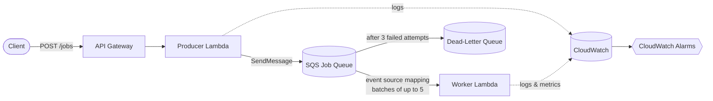

# AWS CDK Asynchronous Job Queue

🌐 Language: **English** | [Español](README.es.md)

### API Gateway → Lambda → SQS → Lambda

A complete but intentionally simple, educational AWS CDK sample demonstrating
**asynchronous background job processing** using API Gateway, Lambda, SQS
(with a dead-letter queue), and CloudWatch — built in TypeScript.

The scenario: a client asks the API to generate a report. The API accepts
the request and returns immediately; a separate worker does the (simulated)
work later, decoupled from the HTTP request entirely. That decoupling —
and everything that comes with it (retries, batching, partial failures,
concurrency limits, at-least-once delivery) — is what this repository is
built to teach.

> This project is optimized for **clarity over abstraction**. It is meant
> to be read, deployed, poked at, and broken on purpose.

---

## Table of contents

- [Problem this architecture solves](#problem-this-architecture-solves)
- [Architecture diagram](#architecture-diagram)
- [Resources created](#resources-created)
- [Request lifecycle](#request-lifecycle)
- [Understanding the SQS visibility timeout](#understanding-the-sqs-visibility-timeout)
- [Batch processing](#batch-processing)
- [Partial batch failures](#partial-batch-failures)
- [Retries and the dead-letter queue](#retries-and-the-dead-letter-queue)
- [Concurrency and backpressure](#concurrency-and-backpressure)
- [Why idempotency matters](#why-idempotency-matters)
- [Failure scenarios](#failure-scenarios)
- [Testing the system](#testing-the-system)
- [Deployment](#deployment)
- [Destruction](#destruction)
- [Security](#security)
- [Cost](#cost)
- [What would change for production?](#what-would-change-for-production)
- [Architectural alternatives considered](#architectural-alternatives-considered)
- [Repository structure](#repository-structure)

---

## Problem this architecture solves

Imagine an API endpoint that generates a report. Report generation might
take several seconds, or minutes.

**Synchronous approach:**

```text
Client → API → Generate report → Wait → Response
```

The HTTP connection stays open for the entire duration of the work. The API
is tightly coupled to report generation: if generation is slow, the
request is slow; if generation fails, the whole request fails; if 1,000
requests arrive at once, 1,000 report-generation processes try to run at
once.

**Asynchronous approach (this repository):**

```text
Client
   ↓
API Gateway
   ↓
Producer Lambda  →  202 Accepted (back to client, immediately)
   ↓
SQS Job Queue
   ↓
Worker Lambda  (runs later, independently)
```

The API accepts the job, hands it to a queue, and responds right away. The
worker processes the job on its own schedule, at its own controlled
concurrency. This improves:

- **Resilience** — a worker crash doesn't fail the client's request; the
  message just waits and retries.
- **Scalability** — the API's response time no longer depends on how long
  report generation takes.
- **Burst handling** — SQS absorbs spikes in demand; the worker drains the
  queue at a steady, controlled rate.
- **Failure isolation** — one bad job doesn't take down the whole batch,
  and repeatedly-failing jobs are isolated to the DLQ instead of blocking
  everything behind them.

## Architecture diagram



See [`docs/architecture.md`](docs/architecture.md) for a deeper breakdown,
including a sequence diagram and the retry/DLQ paths.

## Resources created

| Resource | Purpose |
|---|---|
| **API Gateway REST API** | Exposes `POST /jobs` over HTTPS and synchronously invokes the producer Lambda. |
| **Producer Lambda** | Validates the request, generates a `jobId`, sends the job to SQS, returns `202 Accepted`. |
| **SQS main queue** (`job-queue`) | Durably holds pending jobs; enforces the visibility timeout; tracks receive counts. |
| **SQS dead-letter queue** (`job-queue-dlq`) | Receives messages that failed processing 3 times; isolates them for investigation. |
| **Worker Lambda** | Consumes batches from the main queue; processes each job independently; reports partial batch failures. |
| **SQS event source mapping** | The AWS-managed component that polls the queue and invokes the worker with batches — no custom polling code required. |
| **CloudWatch log groups** | One per Lambda function, capturing structured JSON logs (`jobId`, `reportType`, receive counts, etc.). |
| **CloudWatch alarms** | DLQ-has-messages, oldest-message-age, and worker-errors (see [Failure scenarios](#failure-scenarios)). |

## Request lifecycle

```text
 1. Client sends POST /jobs.
 2. API Gateway invokes the Producer Lambda.
 3. Producer validates the body and generates a jobId.
 4. Producer sends the job to SQS (SendMessage).
 5. Producer returns, and API Gateway responds with HTTP 202.
 6. Independently, AWS Lambda's event source mapping polls SQS.
 7. Worker receives a batch of up to 5 jobs.
 8. Worker processes each job independently.
 9. Successful messages are deleted automatically.
10. Failed messages stay in the queue and become visible again after
    the visibility timeout expires.
11. Messages that fail 3 times are routed to the dead-letter queue.
```

Steps 1–5 happen inside a single HTTP request/response cycle. Steps 6–11
happen entirely separately, on their own schedule — **the client is never
waiting on them.**

Important: **AWS manages the SQS polling.** The worker's code never opens a
loop that asks "any new messages?" — that mechanism (the event source
mapping) is built into Lambda.

## Understanding the SQS visibility timeout

When Lambda's event source mapping receives a message from SQS, SQS does
**not** delete it right away. Instead, it becomes temporarily **invisible**
to other consumers for the queue's configured visibility timeout.

```text
Message available in queue
        ↓
Worker receives it (via the event source mapping)
        ↓
Message becomes invisible to other receivers
        ↓
Worker processes the job
        ↓
   ┌─────────────┴─────────────┐
   ▼                           ▼
Success:                   Failure:
message is deleted        message is NOT deleted
                                ↓
                     visibility timeout expires
                                ↓
                     message becomes visible again
                                ↓
                            retried
```

This mechanism is what makes retries possible — a failed message isn't
lost, it just reappears after the timeout.

**Lambda timeout != SQS visibility timeout.** These are two independent
settings that must be reasoned about together:

| Setting | Value in this sample | What it controls |
|---|---|---|
| Worker Lambda timeout | 15 seconds | How long AWS lets a single invocation run before killing it. |
| SQS visibility timeout | 90 seconds | How long a received message stays hidden from other consumers. |

The visibility timeout is set well **above** the Lambda timeout on
purpose. If it were shorter than (or too close to) the time the worker
actually needs, SQS could make the message visible again — and hand it to
a *second* invocation — **while the first invocation is still running**.
Now two workers are processing the same job concurrently, which is wasted
work at best and a correctness bug at worst if the job has side effects.

This also ties directly into delivery semantics: SQS provides
**at-least-once delivery**. Even with a well-tuned visibility timeout, a
worker may occasionally receive the same logical message more than once
(for example, if it finished the work but the delete acknowledgment didn't
reach SQS in time). See [Why idempotency matters](#why-idempotency-matters).

## Batch processing

```text
SQS queue:  [A] [B] [C] [D] [E]

                  ↓  event source mapping delivers up to batchSize (5)

Worker Lambda invocation:
  event.Records = [A, B, C, D, E]
```

Batching means fewer Lambda invocations are needed to drain a given number
of jobs — more efficient, and cheaper at scale (see
[`docs/cost-considerations.md`](docs/cost-considerations.md)). The
trade-off: a larger batch means a single invocation touches more messages
at once, so a bug that crashes the *entire* function (rather than failing
one job) has a larger blast radius. `batchSize: 5` here is small enough to
watch individual jobs move through a batch during a live demo.

## Partial batch failures

This is one of the most important behaviors this repository teaches.

```text
Batch received:
  A → success
  B → success
  C → failure
  D → success
  E → success
```

**Without a partial batch response**, throwing an exception fails the
*entire* invocation, and SQS would make **all five** messages (A–E)
visible again for retry — including four that already succeeded.

**With a partial batch response** (`reportBatchItemFailures: true` on the
event source mapping), the worker returns exactly which messages failed:

```json
{
  "batchItemFailures": [
    { "itemIdentifier": "message-id-for-C" }
  ]
}
```

Only `C` is retried. `A`, `B`, `D`, and `E` are deleted as successful and
never reprocessed. The worker handler (`src/worker/handler.ts`) implements
this directly:

```typescript
export const handler = async (event: SQSEvent): Promise<SQSBatchResponse> => {
  const batchItemFailures: SQSBatchItemFailure[] = [];

  for (const record of event.Records) {
    try {
      await processRecord(record);
    } catch (error) {
      batchItemFailures.push({ itemIdentifier: record.messageId });
    }
  }

  return { batchItemFailures };
};
```

Note the per-record `try`/`catch` — the loop never throws for the whole
batch just because one job failed.

## Retries and the dead-letter queue

```text
Job
 │
 ▼
Attempt 1 ──✕ fail──▶ wait (visibility timeout)
 │
 ▼
Attempt 2 ──✕ fail──▶ wait (visibility timeout)
 │
 ▼
Attempt 3 ──✕ fail──▶ moves to the Dead-Letter Queue
```

The exact number of attempts is governed by the queue's **redrive
policy**, configured here as `maxReceiveCount: 3` on the main queue,
pointing at the `job-queue-dlq` dead-letter queue.

**What a DLQ is:** a place to durably isolate messages that could not be
processed after repeated attempts, so they can be inspected and, if
appropriate, manually redriven.

**What a DLQ is not:** a fix. Nothing in this stack automatically retries,
repairs, or discards DLQ messages — a human (or a separate remediation
process) has to decide what to do with them. See
[`docs/troubleshooting.md`](docs/troubleshooting.md) for the investigation
workflow.

You can trigger this entire path on demand — see
[Testing the system](#testing-the-system) below.

## Concurrency and backpressure

```text
Incoming jobs
   ↓ ↓ ↓ ↓ ↓ ↓ ↓ ↓
       SQS queue                (absorbs the burst)
     ↓         ↓
  Worker #1  Worker #2          (reservedConcurrentExecutions: 2)
```

The worker Lambda's `reservedConcurrentExecutions` is set to **2** —
deliberately small so it's easy to observe in a demo. This does *not*
limit how fast jobs can be *submitted*; it limits how many jobs can be
*processed simultaneously*. The queue absorbs everything beyond that:

- SQS can hold a large backlog without any special configuration.
- Only 2 worker executions run at once, regardless of how many messages
  are waiting.
- This protects any downstream system the worker calls from being
  overwhelmed by a traffic spike.
- The queue's depth (and `ApproximateAgeOfOldestMessage`) becomes a direct,
  observable measure of backpressure — how much work is waiting for
  capacity.

A simplified mental model (not a precise formula — real systems have more
variables):

```text
approximate throughput ≈ concurrent workers × (1 / processing time per job)
```

## Why idempotency matters

SQS provides **at-least-once delivery** — not exactly-once. Consider:

```text
Worker finishes processing a job
        ↓
Network hiccup / interruption occurs before the delete is acknowledged
        ↓
Visibility timeout expires
        ↓
SQS delivers the same job again
```

The worker must be prepared to see the same `jobId` more than once and
behave safely. This sample does not implement a persistent idempotency
store (adding one, e.g. DynamoDB, purely to demonstrate this would pull
focus from the queueing lesson) — but it shows exactly where one would go,
in `src/worker/handler.ts`:

```typescript
// 1. Look up job.jobId in an idempotency store (e.g. DynamoDB).
// 2. If already marked COMPLETED, return successfully without redoing work.
// 3. Otherwise, process the job.
// 4. Atomically record completion (e.g. a conditional PutItem).
```

For production, reasonable options include:

- **DynamoDB conditional writes** — a `jobId → COMPLETED` record with a
  condition expression that prevents double-processing races.
- **[Powertools for AWS Lambda](https://docs.powertools.aws.dev/lambda/typescript/latest/utilities/idempotency/)**
  idempotency utility — a maintained library that implements this pattern.
- **Domain-specific deduplication** — e.g. if "generate the monthly-sales
  report for August" is naturally idempotent (regenerating it just
  overwrites the same output), you may not need an explicit store at all.

## Failure scenarios

| Failure | What happens |
|---|---|
| Producer cannot reach SQS | The API request fails (5xx); no job is queued. |
| Worker crashes (unhandled exception outside per-job handling) | Nothing in the batch is deleted; the whole batch becomes visible again after the visibility timeout. |
| One message in a batch fails | Only that message is retried, via the partial batch response. |
| A job repeatedly fails | After 3 receives, the message moves to the DLQ. |
| Worker concurrency (2) is exhausted | Additional messages simply wait in the queue — this is backpressure, not an error. |
| A duplicate message is delivered | Expected under at-least-once delivery; a production worker should be idempotent (see above). |

## Testing the system

After deploying (see [Deployment](#deployment)), grab the API URL from the
stack outputs:

```bash
export API_URL=$(aws cloudformation describe-stacks \
  --stack-name AwsCdkLambdaSqsWorkerStack \
  --query "Stacks[0].Outputs[?OutputKey=='ApiUrl'].OutputValue" \
  --output text)
```

**Submit a normal job:**

```bash
curl -X POST "${API_URL}jobs" \
  -H "Content-Type: application/json" \
  -d '{
    "reportType": "monthly-sales",
    "requestedBy": "demo@example.com"
  }'
```

You should immediately get back a `202` with a `jobId` — before any report
"generation" has happened.

**Submit a deliberately failing job** (to watch the retry → DLQ path):

```bash
curl -X POST "${API_URL}jobs" \
  -H "Content-Type: application/json" \
  -d '{
    "reportType": "monthly-sales",
    "requestedBy": "demo@example.com",
    "simulateFailure": true
  }'
```

**What to watch, in order:**

1. **API response** — still `202 Accepted` immediately; the API has no
   idea the job will fail.
2. **Producer CloudWatch logs** (`/aws/lambda/job-queue-producer`) — "Job
   accepted" / "Job sent to queue" with the `jobId`.
3. **SQS queue metrics** (console or `aws cloudwatch get-metric-statistics`
   on `ApproximateNumberOfMessagesVisible` / `ApproximateAgeOfOldestMessage`
   for `job-queue`) — watch the message count and age.
4. **Worker CloudWatch logs** (`/aws/lambda/job-queue-worker`) — "Processing
   job", then "Simulated failure for job `<id>`", repeating on a ~90s
   cadence as the visibility timeout expires and the message is redelivered.
5. **`ApproximateReceiveCount`** — logged by the worker on each attempt;
   watch it climb from 1 to 2 to 3.
6. **DLQ** — after the 3rd failure, check the `job-queue-dlq` queue (console
   or `aws sqs receive-message --queue-url <dlq-url>`) for the message, and
   confirm the `job-queue-dlq-has-messages` alarm has moved to `ALARM`.

## Deployment

```bash
npm install
npm test
npm run build
npx cdk synth
npx cdk diff
npx cdk deploy
```

If you have never deployed CDK apps to this AWS account/region before, you
need to bootstrap it **once** (not on every deployment):

```bash
npx cdk bootstrap
```

## Destruction

```bash
npx cdk destroy
```

This removes every resource this stack created (API Gateway, both Lambdas,
both SQS queues, alarms, and their log groups). Note that CloudWatch log
groups and other resources can behave differently depending on removal
policy configuration — review `cdk diff` output before destroying if you're
unsure what will be removed.

## Security

Summary: the producer can only send to the job queue; the worker can only
receive/delete from it; neither has broad SQS permissions; the API is
TLS-only but **unauthenticated** in this sample (a real deployment needs
API authentication). Full details, including what's implemented here versus
recommended for production, are in
[`docs/security.md`](docs/security.md).

## Cost

Summary: cost is driven by API Gateway requests, Lambda invocations and
duration (both functions), SQS API calls, and CloudWatch Logs volume.
Batching reduces worker invocation count; a queue smooths load but doesn't
reduce total processing cost. Pricing changes over time — see
[`docs/cost-considerations.md`](docs/cost-considerations.md) for a fuller
discussion and always check current AWS pricing pages before estimating a
real workload.

## What would change for production?

This sample deliberately stops short of production-readiness so the
queueing concepts stay front and center. Clearly:

**Implemented in this sample:**
- Decoupled async processing via SQS
- Partial batch failure handling
- DLQ with a redrive policy
- Reserved concurrency
- Basic CloudWatch alarms
- Least-privilege IAM per function

**Recommended for production** (not implemented here):
- API authentication/authorization
- Persistent job state and a real idempotency store (e.g. DynamoDB)
- A `GET /jobs/{jobId}` status API backed by that store (see below)
- Stricter input validation
- Correlation IDs and distributed tracing (e.g. AWS X-Ray)
- Structured operational dashboards
- Alarm notifications (e.g. SNS + on-call integration)
- Retry classification (retryable vs. non-retryable errors handled
  differently)
- A defined DLQ replay strategy
- Encryption with customer-managed KMS keys
- Secrets management (if the worker needs credentials)
- Separate deployment environments and CI/CD
- Integration and load testing
- Concurrency planning based on real traffic and downstream capacity
- Operational alerting thresholds based on real queue-depth baselines

**No job-status API on purpose:** this sample does not implement
`GET /jobs/{jobId}`, because that would require persistent job state
(e.g. a DynamoDB table tracking status per `jobId`) which is a separate
concern from the queue mechanics this repository focuses on. In a
production system, you'd typically add such an endpoint backed by the same
store used for idempotency.

## Architectural alternatives considered

| Alternative | Good for | Why not used here |
|---|---|---|
| **Synchronous Lambda** (`API Gateway → Lambda`, no queue) | Fast work where the caller needs an immediate result. | Doesn't fit long-running background work; couples the API's latency to processing time. |
| **SNS** | Fan-out / pub-sub to multiple subscribers. | Different problem — SNS doesn't provide a durable work queue with visibility timeouts and per-message retry semantics the way SQS does. |
| **EventBridge** | Event routing and event-driven integration across services. | Better suited to routing/filtering events than acting as a straightforward worker queue. |
| **Step Functions** | Multi-step workflows: branching, retries with custom logic, human approval steps, orchestration. | Would be excessive for one simple "process a job" operation. |
| **AWS Batch / ECS/Fargate** | Heavy or long-running compute workloads. | Overkill for short, bursty, event-driven jobs like this sample's simulated report generation. |
| **Direct async Lambda invocation** (`Invoke` with `InvocationType: Event`) | Simple fire-and-forget for some use cases. | Doesn't expose queue depth, backpressure, or the retry/DLQ controls SQS provides — much harder to observe or throttle. |

**SQS + Lambda** is the right fit here because it gives durable
buffering, built-in retry via visibility timeouts, a natural place for a
DLQ, and concurrency controls — all directly observable — without
introducing orchestration machinery this simple scenario doesn't need.

## Repository structure

```text
aws-cdk-lambda-sqs-worker/
├── README.md
├── package.json
├── cdk.json
├── tsconfig.json
├── jest.config.js
│
├── bin/
│   └── aws-cdk-lambda-sqs-worker.ts     # CDK app entry point
│
├── lib/
│   └── aws-cdk-lambda-sqs-worker-stack.ts  # All infrastructure
│
├── src/
│   ├── producer/handler.ts              # Validates + enqueues jobs
│   ├── worker/handler.ts                # Processes batches from SQS
│   └── shared/types.ts                  # ReportJob and request/response types
│
├── docs/
│   ├── architecture.md
│   ├── security.md
│   ├── cost-considerations.md
│   └── troubleshooting.md
│
├── website/                             # Static educational landing page
│   └── index.html
│
└── test/
    ├── stack.test.ts                    # CDK assertions
    ├── producer.test.ts                 # Producer handler unit tests
    └── worker.test.ts                   # Worker partial-batch-failure tests
```
