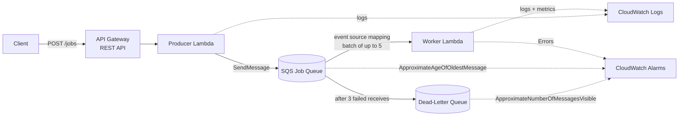
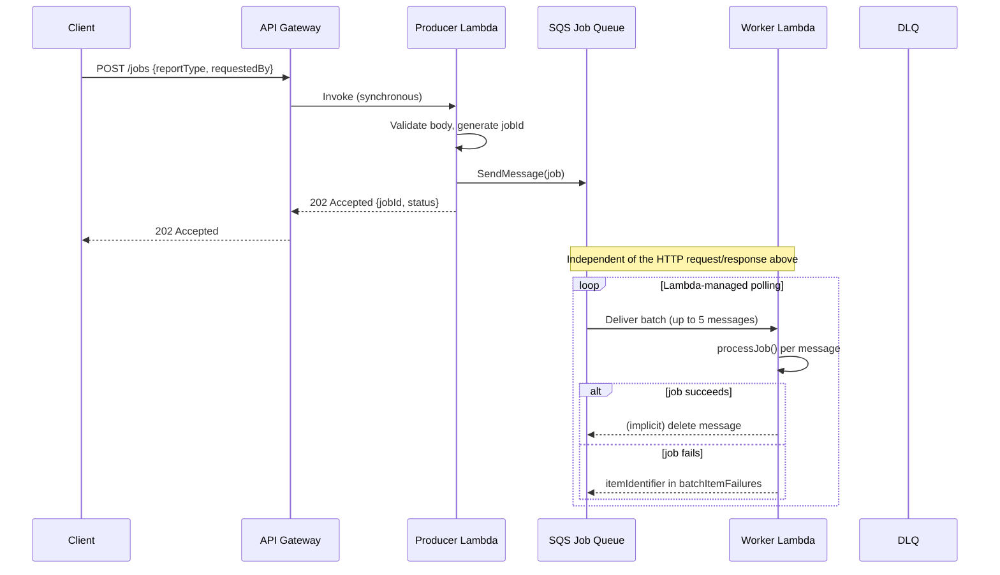

# Architecture

🌐 Language: **English** | [Español](es/architecture.md)

This document goes deeper than the README into how the pieces fit together,
why the configuration values were chosen, and what happens on each path
through the system (success, retry, DLQ).

## Overview



## Component responsibilities

| Component | Responsibility | Responsibility it does **not** have |
|---|---|---|
| API Gateway | Accepts `POST /jobs` over HTTPS, invokes the producer synchronously, returns its response to the caller. | Does not talk to SQS directly, does not know about report generation. |
| Producer Lambda | Validates the request body, generates `jobId`, sends one message to the main queue, returns `202`. | Never generates a report; never reads from the queue. |
| SQS main queue | Durably holds queued jobs; enforces the visibility timeout; tracks receive counts; redrives to the DLQ. | Does not run any code; does not guarantee exactly-once delivery. |
| Worker Lambda | Consumes batches via the managed event source mapping; processes each job independently; reports partial batch failures. | Never sends messages back to the queue itself (retry is implicit via "not deleted"). |
| Dead-letter queue | Stores messages whose retries were exhausted, for inspection/replay. | Does not retry or fix anything automatically. |
| CloudWatch | Captures structured logs from both Lambdas; evaluates alarms on queue/DLQ/error metrics. | Does not notify anyone in this sample — no SNS topic is wired up. |

## Request lifecycle (sequence diagram)



The client never waits on the lower half of this diagram. By the time the
worker even sees the job, the HTTP response has already been sent.

## AWS manages the polling loop

A common misconception is that "SQS invokes Lambda." It does not. SQS is a
passive queue with no ability to call anything. AWS Lambda's **event source
mapping** is a separate, managed component that:

1. Continuously polls the queue (long polling) on your behalf.
2. Groups available messages into a batch (bounded by `batchSize` and a
   collection window).
3. Invokes the worker function with that batch as the event payload.
4. Interprets the function's response (or lack of one) to decide which
   messages to delete and which to leave for retry.

The application code in `src/worker/handler.ts` never opens a connection to
SQS to ask "any messages for me?" — that loop is entirely AWS-managed.

## Normal processing path

1. Message is sent to the queue by the producer.
2. Event source mapping picks it up in a batch and invokes the worker.
3. `processJob()` runs, logs start/completion, and returns normally.
4. The worker does not add the message's `messageId` to `batchItemFailures`.
5. Lambda deletes the message from the queue on the caller's behalf.

## Retry path

1. `processJob()` throws (either a real error or a `simulateFailure: true`
   job).
2. The worker catches the error and adds `{ itemIdentifier: messageId }` to
   `batchItemFailures`.
3. Lambda does **not** delete that message; it remains in the queue, but
   invisible until `QUEUE_VISIBILITY_TIMEOUT` (90s) elapses.
4. Once visible again, the event source mapping can deliver it in a future
   batch. `ApproximateReceiveCount` on the message attributes is now `2`.
5. This repeats until the job succeeds, or until it has been received
   `DLQ_MAX_RECEIVE_COUNT` (3) times.

## DLQ path

1. After the 3rd failed receive, SQS's redrive policy moves the message to
   the dead-letter queue instead of making it visible in the main queue
   again.
2. The `job-queue-dlq-has-messages` CloudWatch alarm (on
   `ApproximateNumberOfMessagesVisible > 0`) transitions to `ALARM`.
3. Nothing further happens automatically — an operator must inspect the DLQ
   (see `docs/troubleshooting.md`) and decide whether to fix the root cause
   and redrive the message, or discard it.

## Batch processing and partial batch failures

The worker receives up to `WORKER_BATCH_SIZE` (5) messages per invocation.
Batching reduces the number of Lambda invocations needed to drain a given
number of jobs, which is more efficient — but a larger batch also means a
single invocation touches more messages, so a bug that crashes the whole
function (rather than a single job) has a larger blast radius.

Within a batch, each record is processed **independently**:

```text
Batch received:  A(ok)  B(ok)  C(fail)  D(ok)  E(ok)

Handler returns:
{
  "batchItemFailures": [
    { "itemIdentifier": "<message-id-of-C>" }
  ]
}
```

Because the event source mapping is configured with
`reportBatchItemFailures: true` (CDK: `SqsEventSource(..., {
reportBatchItemFailures: true })`), Lambda trusts this response and only
returns `C` to the queue. Without that configuration, a thrown exception
would fail the *entire* invocation, and SQS would redeliver **all five**
messages — including the four that already succeeded — which is wasteful
and, without idempotency, dangerous.

## Concurrency and backpressure

```text
Incoming jobs (burst)
   ↓↓↓↓↓↓↓↓↓↓↓↓
      SQS queue                 <- absorbs the burst
   ↓        ↓
Worker 1  Worker 2               <- reservedConcurrentExecutions: 2
```

`reservedConcurrentExecutions: 2` caps the worker at two simultaneous
executions, no matter how many messages arrive. Extra jobs simply wait in
the queue — this waiting is backpressure made visible as queue depth /
`ApproximateAgeOfOldestMessage`, rather than as failed requests or an
overwhelmed downstream system.

An intentionally simplified throughput relationship:

```text
approximate throughput ≈ concurrent workers × (1 / average processing time)
```

Real systems have more variables (cold starts, SQS batching efficiency,
retries consuming capacity, etc.) — treat this only as intuition-building,
not a capacity-planning formula.

## Delivery semantics and idempotency

SQS standard queues provide **at-least-once delivery**: under normal
operation a message is typically delivered once, but the system is
explicitly allowed to deliver it again (for example, if the worker finished
processing but the delete acknowledgment did not reach SQS before the
visibility timeout expired). Consumers must tolerate this.

`src/worker/handler.ts` documents, in comments, where a production
implementation would add an idempotency check:

```typescript
// 1. Look up job.jobId in an idempotency store (e.g. DynamoDB).
// 2. If already COMPLETED, return successfully without redoing work.
// 3. Otherwise, do the work.
// 4. Atomically record completion (e.g. conditional PutItem).
```

This sample does not implement that store — adding DynamoDB purely to
demonstrate the concept would dilute the queueing lesson. See
`docs/security.md` and the README's "Production considerations" for further
discussion.

## Design decisions

| Decision | Why |
|---|---|
| REST API (not HTTP API) | `apigateway.RestApi` keeps the sample on the most widely-documented API Gateway construct; either would work for a single POST route. |
| Standard SQS queue (not FIFO) | FIFO adds ordering/dedup guarantees and constraints that are unnecessary for teaching the retry/DLQ/backpressure concepts here. |
| `NodejsFunction` (esbuild bundling) | Bundles TypeScript handlers without a separate build step or Docker requirement, keeping `cdk synth`/`cdk deploy` simple. |
| No DynamoDB / job-status API | Keeps the resource list to exactly what's needed to teach the queue mechanics; see README for the production alternative. |
| Explicit `logGroup` with 1-week retention on both functions | Prevents CloudWatch log groups from retaining data (and accruing cost) indefinitely in a demo account. |

## Production evolution

See the README section **"What Would Change for Production?"** for the full
list. In short: authentication on the API, a persistent idempotency store,
input validation hardening, correlation IDs and tracing, alarm
notifications (SNS), a DLQ replay strategy, and CI/CD with automated tests
would all be expected before this pattern runs a real workload.
