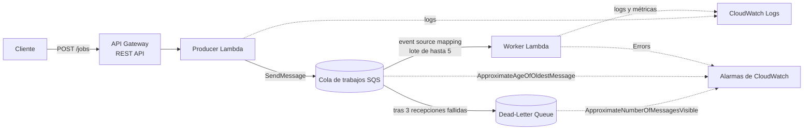
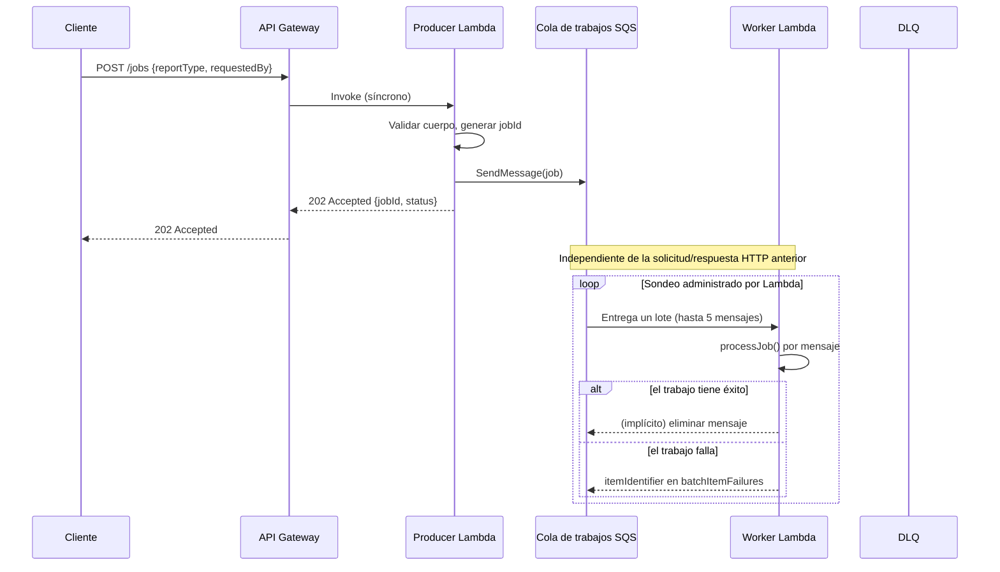

# Arquitectura

🌐 Idioma: [English](../architecture.md) | **Español**

Este documento profundiza más que el README en cómo encajan las piezas,
por qué se eligieron los valores de configuración, y qué ocurre en cada
ruta a través del sistema (éxito, reintento, DLQ).

## Descripción general



## Responsabilidades de los componentes

| Componente | Responsabilidad | Responsabilidad que **no** tiene |
|---|---|---|
| API Gateway | Acepta `POST /jobs` sobre HTTPS, invoca al producer de forma síncrona, devuelve su respuesta al llamador. | No habla directamente con SQS; no sabe nada sobre la generación de reportes. |
| Producer Lambda | Valida el cuerpo de la solicitud, genera el `jobId`, envía un mensaje a la cola principal, devuelve `202`. | Nunca genera un reporte; nunca lee de la cola. |
| Cola principal de SQS | Almacena de forma durable los trabajos encolados; aplica el tiempo de visibilidad; rastrea los conteos de recepción; redirige a la DLQ. | No ejecuta ningún código; no garantiza entrega exactamente una vez. |
| Worker Lambda | Consume lotes vía el event source mapping administrado; procesa cada trabajo de forma independiente; reporta fallos parciales del lote. | Nunca reenvía mensajes a la cola por sí mismo (el reintento es implícito al "no eliminar"). |
| Cola de mensajes fallidos (DLQ) | Almacena los mensajes cuyos reintentos se agotaron, para inspección/reenvío. | No reintenta ni repara nada automáticamente. |
| CloudWatch | Captura logs estructurados de ambas Lambdas; evalúa alarmas sobre métricas de cola/DLQ/errores. | No notifica a nadie en este ejemplo — no hay ningún topic de SNS conectado. |

## Ciclo de vida de la solicitud (diagrama de secuencia)



El cliente nunca espera por la mitad inferior de este diagrama. Para cuando
el worker siquiera ve el trabajo, la respuesta HTTP ya fue enviada.

## AWS administra el bucle de sondeo

Un malentendido común es pensar que "SQS invoca a Lambda". No es así. SQS
es una cola pasiva sin capacidad de invocar nada. El **event source
mapping** de AWS Lambda es un componente separado y administrado que:

1. Sondea continuamente la cola (long polling) en tu nombre.
2. Agrupa los mensajes disponibles en un lote (limitado por `batchSize` y
   una ventana de recolección).
3. Invoca a la función worker con ese lote como payload del evento.
4. Interpreta la respuesta de la función (o su ausencia) para decidir qué
   mensajes eliminar y cuáles dejar para reintento.

El código de la aplicación en `src/worker/handler.ts` nunca abre una
conexión hacia SQS para preguntar "¿hay mensajes para mí?" — ese bucle es
completamente administrado por AWS.

## Ruta de procesamiento normal

1. El producer envía el mensaje a la cola.
2. El event source mapping lo recoge en un lote e invoca al worker.
3. `processJob()` se ejecuta, registra el inicio/finalización, y retorna
   normalmente.
4. El worker no agrega el `messageId` del mensaje a `batchItemFailures`.
5. Lambda elimina el mensaje de la cola en nombre del llamador.

## Ruta de reintento

1. `processJob()` lanza una excepción (ya sea un error real o un trabajo
   con `simulateFailure: true`).
2. El worker captura el error y agrega `{ itemIdentifier: messageId }` a
   `batchItemFailures`.
3. Lambda **no** elimina ese mensaje; permanece en la cola, pero invisible
   hasta que transcurre `QUEUE_VISIBILITY_TIMEOUT` (90s).
4. Una vez visible de nuevo, el event source mapping puede entregarlo en un
   lote futuro. El `ApproximateReceiveCount` en los atributos del mensaje
   ahora es `2`.
5. Esto se repite hasta que el trabajo tenga éxito, o hasta que haya sido
   recibido `DLQ_MAX_RECEIVE_COUNT` (3) veces.

## Ruta de la DLQ

1. Tras la 3ª recepción fallida, la política de redrive de SQS mueve el
   mensaje a la cola de mensajes fallidos en lugar de volver a hacerlo
   visible en la cola principal.
2. La alarma de CloudWatch `job-queue-dlq-has-messages` (sobre
   `ApproximateNumberOfMessagesVisible > 0`) pasa al estado `ALARM`.
3. Nada más ocurre automáticamente — un operador debe inspeccionar la DLQ
   (ver `docs/es/troubleshooting.md`) y decidir si corregir la causa raíz y
   reenviar (*redrive*) el mensaje, o descartarlo.

## Procesamiento por lotes y fallos parciales

El worker recibe hasta `WORKER_BATCH_SIZE` (5) mensajes por invocación. El
procesamiento por lotes reduce el número de invocaciones de Lambda
necesarias para drenar una cantidad determinada de trabajos, lo cual es más
eficiente — pero un lote más grande también implica que una sola invocación
toca más mensajes, por lo que un error que colapsa toda la función (en
lugar de un solo trabajo) tiene un radio de impacto mayor.

Dentro de un lote, cada registro se procesa **de forma independiente**:

```text
Lote recibido:  A(ok)  B(ok)  C(falla)  D(ok)  E(ok)

El handler retorna:
{
  "batchItemFailures": [
    { "itemIdentifier": "<message-id-de-C>" }
  ]
}
```

Debido a que el event source mapping está configurado con
`reportBatchItemFailures: true` (CDK: `SqsEventSource(..., {
reportBatchItemFailures: true })`), Lambda confía en esta respuesta y solo
devuelve `C` a la cola. Sin esa configuración, una excepción lanzada
haría fallar *toda* la invocación, y SQS reentregaría los **cinco**
mensajes — incluyendo los cuatro que ya tuvieron éxito — lo cual es
derrochador y, sin idempotencia, peligroso.

## Concurrencia y contrapresión

```text
Trabajos entrantes (ráfaga)
   ↓↓↓↓↓↓↓↓↓↓↓↓
      Cola SQS                  <- absorbe la ráfaga
   ↓        ↓
Worker 1  Worker 2               <- reservedConcurrentExecutions: 2
```

`reservedConcurrentExecutions: 2` limita al worker a dos ejecuciones
simultáneas, sin importar cuántos mensajes lleguen. Los trabajos
adicionales simplemente esperan en la cola — esta espera es contrapresión
(*backpressure*) hecha visible como profundidad de la cola /
`ApproximateAgeOfOldestMessage`, en lugar de como solicitudes fallidas o un
sistema downstream desbordado.

Una relación de throughput deliberadamente simplificada:

```text
throughput aproximado ≈ workers concurrentes × (1 / tiempo promedio de procesamiento)
```

Los sistemas reales tienen más variables (cold starts, eficiencia del
batching de SQS, reintentos consumiendo capacidad, etc.) — trata esto solo
como una intuición, no como una fórmula de planificación de capacidad.

## Semántica de entrega e idempotencia

Las colas estándar de SQS proveen **entrega al menos una vez**
(*at-least-once delivery*): en condiciones normales, un mensaje típicamente
se entrega una sola vez, pero el sistema tiene permitido explícitamente
entregarlo de nuevo (por ejemplo, si el worker terminó de procesar pero el
acuse de eliminación no llegó a SQS antes de que expirara el tiempo de
visibilidad). Los consumidores deben tolerar esto.

`src/worker/handler.ts` documenta, en comentarios, dónde una implementación
de producción agregaría una verificación de idempotencia:

```typescript
// 1. Buscar job.jobId en un almacén de idempotencia (p. ej. DynamoDB).
// 2. Si ya está COMPLETED, retornar éxito sin repetir el trabajo.
// 3. En caso contrario, realizar el trabajo.
// 4. Registrar la finalización de forma atómica (p. ej. PutItem condicional).
```

Este ejemplo no implementa ese almacén — agregar DynamoDB únicamente para
demostrar el concepto diluiría la lección sobre colas. Ver
`docs/es/security.md` y la sección "Consideraciones para producción" del
README para mayor discusión.

## Decisiones de diseño

| Decisión | Por qué |
|---|---|
| REST API (no HTTP API) | `apigateway.RestApi` mantiene el ejemplo sobre el constructo de API Gateway más ampliamente documentado; cualquiera de los dos funcionaría para una sola ruta POST. |
| Cola SQS estándar (no FIFO) | FIFO agrega garantías de orden/deduplicación y restricciones innecesarias para enseñar los conceptos de reintento/DLQ/contrapresión aquí presentados. |
| `NodejsFunction` (empaquetado con esbuild) | Empaqueta los handlers de TypeScript sin un paso de build separado ni requerir Docker, manteniendo simples a `cdk synth`/`cdk deploy`. |
| Sin DynamoDB / API de estado de trabajos | Mantiene la lista de recursos exactamente en lo necesario para enseñar la mecánica de colas; ver el README para la alternativa de producción. |
| `logGroup` explícito con retención de 1 semana en ambas funciones | Evita que los grupos de logs de CloudWatch retengan datos (y acumulen costo) indefinidamente en una cuenta de demostración. |

## Evolución hacia producción

Consulta la sección **"¿Qué cambiaría para producción?"** del README para
la lista completa. En resumen: autenticación en la API, un almacén
persistente de idempotencia, refuerzo de la validación de entrada, IDs de
correlación y trazabilidad, notificaciones de alarmas (SNS), una estrategia
de redrive para la DLQ, y CI/CD con pruebas automatizadas se esperarían
todos antes de que este patrón ejecute una carga de trabajo real.
